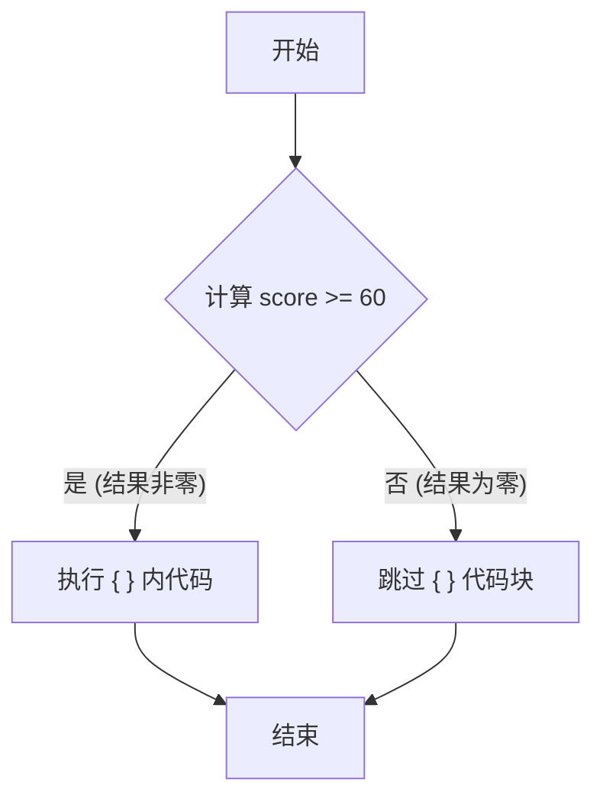
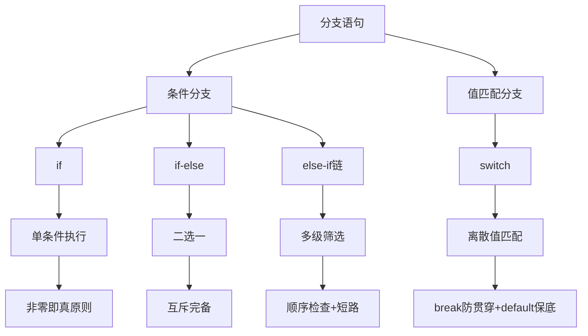

欢迎来到 C 语言学习的第二天！如果说变量是程序的“记忆”，运算符是程序的“肌肉”，那么**分支语句**就是程序的“大脑”——它赋予程序**思考、判断和决策**的能力。

想象一个没有分支的程序：它只能从上到下机械地执行指令，像一条笔直的单行道。而有了分支，程序就能像人类一样，在十字路口根据“红绿灯”（条件）选择不同的路径，实现智能响应。

> **现实类比**：  
> - `if` → 单向判断：“如果下雨，我就带伞。”  
> - `if-else` → 二选一：“如果晴天去公园，否则在家看书。”  
> - `else if` 链 → 多级筛选：“成绩≥90→A，≥80→B，≥70→C...”  
> - `switch` → 精准匹配：“按1查余额，按2转账，按3退出...”

通过本章系统学习，你将掌握让程序“活起来”的核心技能！

---

## 分支结构全景图

在深入语法前，先建立整体认知。C 语言的分支结构可分为两大类：

| 类型          | 适用场景                          | 核心特点                     |
|---------------|-----------------------------------|------------------------------|
| **条件分支**  | 基于布尔表达式（真/假）           | `if`, `if-else`, `else if`   |
| **值匹配分支**| 基于离散值精确匹配                | `switch`                     |

> **选择指南**：  
> - 用 `if` 系列处理**范围判断**（如 `score > 60`）或**复杂逻辑**（如 `age>18 && hasLicense`）  
> - 用 `switch` 处理**固定值枚举**（如菜单选项、状态码、字符等级）

---

## 条件分支

### 2.1 `if` 语句 —— 最基础的决策单元

#### 核心概念：C 语言的“真”与“假”

这是理解所有条件语句的基石：

```c
// C 语言真假规则（必须牢记！）
真 (True)  → 任何**非零值**（1, -5, 0xFF, 'A'...）
假 (False) → **零值**（0, '\0', 0.0, NULL...）
```

> **深度解析**：  
> C 语言诞生时（1972年）尚无布尔类型。直到 C99 标准才通过 `<stdbool.h>` 引入 `bool`/`true`/`false`，但其本质仍是 `int` 类型的宏：
> ```c
> #define bool  _Bool
> #define true  1
> #define false 0
> ```
> **因此，`if(1)`, `if(-1)`, `if('A')` 都为真！**

#### 语法结构与执行流程

```c
if (条件表达式) {
    // 条件为真时执行的代码块
    // 可包含多条语句
}
// 程序继续执行后续代码
```

#### 来个例子

```c
#include <stdio.h>

int main() {
    int score = 85;  // 可修改测试不同分数

    printf("正在评估成绩...\n");
    
    // 条件判断：关系表达式返回 1(真) 或 0(假)
    if (score >= 60) {
        printf("恭喜！您已通过考试！\n");
        printf("您的成绩是: %d 分\n", score);
        printf("继续保持！\n");
    }
    // 注意：如果条件为假，此代码块被完全跳过

    printf("评估完成。\n");
    return 0;
}
```

**执行流程图解**：


#### 新手易错点：省略大括号的风险

```c
// 危险代码！缩进具有欺骗性
if (score >= 60)
    printf("通过！\n");
    printf("成绩：%d\n", score); // 此行总会执行！与if无关！

// 安全写法：始终使用{}
if (score >= 60) {
    printf("通过！\n");
    printf("成绩：%d\n", score); // 明确受if控制
}
```

> **最佳实践**：**永远为 if/else 添加大括号**，即使只有一行代码！

---

### 2.2 `if-else` 语句 —— 二选一的岔路口

#### 语法结构

```c
if (条件表达式) {
    // 条件为真时执行
} else {
    // 条件为假时执行（必选其一）
}
```

#### 经典永流传

```c
#include <stdio.h>

int main() {
    int temperature = 35;  // 尝试改为 25, 15

    printf("当前温度: %d°C\n", temperature);
    
    if (temperature > 30) {
        printf("高温预警！建议：\n");
        printf("  - 避免正午外出\n");
        printf("  - 多补充水分\n");
    } else {
        printf("天气舒适！建议：\n");
        printf("  - 适合户外活动\n");
        printf("  - 享受阳光\n");
    }

    return 0;
}
```

**关键特性**：
- **互斥性**：`if` 和 `else` 代码块永不同时执行
- **完备性**：无论条件真假，总有一个分支会被执行

#### 老曼波口诀：  
> “**if 真走上面，else 假走下面，二选一不落空**”

---

### 2.3 `else if` 链 —— 多重选择的智能阶梯

#### 语法结构与执行逻辑

```c
if (条件1) {
    // 条件1为真时执行
} else if (条件2) {  // 可多个 else if
    // 条件1假且条件2真时执行
} else if (条件3) {
    // 前面都假且条件3真时执行
} else {             // 可选
    // 所有条件都为假时执行
}
```

**执行规则**：
1. 从上到下**顺序检查**每个条件
2. 遇到**第一个为真**的条件，执行对应代码块
3. 执行后**立即跳出**整个结构（后续条件不再检查）
4. 若所有条件为假，执行 `else` 块（如存在）

#### 又是一个示例

```c
#include <stdio.h>

int main() {
    int score = 89;  // 测试值：95, 85, 75, 65, 55, 90, 80...

    printf("成绩: %d → ", score);

    if (score >= 90) {
        printf("优秀 (A)\n");
    } else if (score >= 80) {  // 注意：隐含 score<90
        printf("良好 (B)\n");
    } else if (score >= 70) {  // 隐含 score<80
        printf("中等 (C)\n");
    } else if (score >= 60) {  // 隐含 score<70
        printf("及格 (D)\n");
    } else {                   // score < 60
        printf("不及格 (F)\n");
    }

    return 0;
}
```

#### 致命陷阱：条件顺序错误

```c
// 错误顺序：宽松条件在前
if (score >= 60) {
    printf("D"); // 95分也会进入此分支！
} else if (score >= 90) {
    printf("A"); // 永远不会执行！
}

// 正确顺序：严格条件在前
if (score >= 90) {
    printf("A");
} else if (score >= 60) { // 此时隐含 score<90
    printf("D");
}
```

> **最佳实践**：  
> 1. 将**最严格/最可能**的条件放在前面  
> 2. 利用**隐含范围**减少冗余判断（如 `score>=80` 隐含 `score<90`）  
> 3. 使用 `else` 处理剩余情况，避免遗漏

---

## `switch` 语句 —— 高效的值匹配引擎

### 3.1 核心概念与适用场景

当需要根据**单个变量的精确值**进行多路分支时，`switch` 比 `else if` 链更高效、更清晰。

**适用场景**：
- 菜单选择（1-查看，2-编辑，3-删除...）
- 状态机（IDLE, RUNNING, PAUSED...）
- 字符处理（'A', 'B', 'C'...）
- 枚举类型

### 3.2 语法结构深度解析

```c
switch (控制表达式) {  // 必须是整型(char/int/enum等)
    case 常量1:        // 必须是编译时常量
        语句1;
        break;         // 关键！防止贯穿
        
    case 常量2:
        语句2;
        break;
        
    // ...更多 case
    
    default:           // 可选，处理未匹配情况
        默认语句;
        break;
}
```

#### 关键组件说明：

| 组件           | 作用                                                                 | 注意事项                     |
|----------------|----------------------------------------------------------------------|------------------------------|
| **控制表达式** | 计算结果必须为整型（`int`, `char`, `enum`）                          | 不能是浮点数或字符串         |
| **case 标签**  | 后跟**常量表达式**（如 `1`, `'A'`, `RED`）                           | 不能是变量或范围（如 `1-5`） |
| **break**      | 跳出 `switch`，防止执行下一个 `case`                                 | 遗漏会导致“贯穿”(fall-through) |
| **default**    | 当无 `case` 匹配时执行，**强烈建议添加**以提高健壮性                 | 可放在任意位置（通常最后）   |

### 3.3 实战案例：学生成绩等级查询系统

```c
#include <stdio.h>

int main() {
    char grade = 'B';  // 测试：'A', 'C', 'X', 'b'

    printf("等级 '%c' 对应：\n", grade);

    switch (grade) {
        case 'A':  // 注意：case 区分大小写！
        case 'a':  // 处理小写（故意贯穿）
            printf("优秀：90-100分\n");
            break; // 跳出switch
            
        case 'B':
        case 'b':
            printf("良好：80-89分\n");
            break;
            
        case 'C':
        case 'c':
            printf("中等：70-79分\n");
            break;
            
        case 'D':
        case 'd':
            printf("及格：60-69分\n");
            break;
            
        case 'F':
        case 'f':
            printf("不及格：<60分\n");
            break;
            
        default:   // 处理无效输入
            printf("错误：无效等级 '%c'\n", grade);
            printf("   有效等级：A/a, B/b, C/c, D/d, F/f\n");
            break;
    }

    return 0;
}
```

### 3.4 核心陷阱：贯穿（Fall-through）现象

```c
// 示例：危险的贯穿
int day = 2;
switch (day) {
    case 1:
        printf("星期一");
        // 遗漏 break！
    case 2:
        printf("星期二"); // 会执行！
        break;
    case 3:
        printf("星期三");
        break;
}
// 输出：星期一星期二 （非预期！）

// 正确写法：
case 1:
    printf("星期一");
    break; // 明确终止
```

#### 何时需要故意贯穿？

```c
// 合并相同处理逻辑
switch (month) {
    case 1: case 3: case 5: case 7: case 8: case 10: case 12:
        printf("31天");
        break;
    case 4: case 6: case 9: case 11:
        printf("30天");
        break;
    case 2:
        printf("28或29天");
        break;
    default:
        printf("无效月份");
        break;
}
```

> **最佳实践**：  
> 1. **每个 `case` 结尾必须有 `break`**（除非故意贯穿）  
> 2. 故意贯穿时添加注释：`/* Fall through */`  
> 3. **始终包含 `default` 分支**处理异常值  
> 4. 使用 `enum` 替代魔术数字提升可读性

---

## 复杂逻辑构建

### 4.1 分支嵌套 —— 多层决策树

当决策需要多级判断时，可嵌套分支结构。

#### 你考驾照了吗？

```c
#include <stdio.h>

int main() {
    int age = 17;          // 测试：25, 16, 18
    int hasLicense = 0;    // 1=有, 0=无

    printf("=== 驾驶资格检查 ===\n");
    printf("年龄: %d岁, 驾照: %s\n", 
           age, hasLicense ? "有" : "无");

    if (age >= 18) {
        printf("年龄符合要求\n");
        
        if (hasLicense) {  // 嵌套if
            printf("持有有效驾照\n");
            printf("结论：可以合法驾驶！\n");
        } else {
            printf("无驾照\n");
            printf("结论：需先考取驾照\n");
        }
        
    } else {
        printf("年龄不足18岁\n");
        printf("结论：需等待成年\n");
    }

    return 0;
}
```

#### 使用逻辑运算符扁平化

```c
// 使用 && 替代嵌套，更简洁
if (age >= 18 && hasLicense) {
    printf("可以合法驾驶！");
} else if (age >= 18 && !hasLicense) {
    printf("需先考取驾照");
} else {
    printf("需等待成年");
}
```

> **最佳实践**：  
> - 避免超过**3层嵌套**（否则重构为函数）  
> - 优先用 `&&`/`||` 简化简单嵌套  
> - 复杂逻辑拆分为独立函数

### 4.2 逻辑运算符 —— 构建复合条件

| 运算符 | 名称   | 说明                     | 示例               |
|--------|--------|--------------------------|--------------------|
| `&&`   | 逻辑与 | 两边都为真时结果为真     | `age>=18 && hasLicense` |
| `||`   | 逻辑或 | 任一边为真时结果为真     | `isWeekend || isHoliday` |
| `!`    | 逻辑非 | 取反（真变假，假变真）   | `!isValid`         |

#### 短路求值（Short-circuit Evaluation）

```c
// && 短路：左操作数为假时，不计算右操作数
if (ptr != NULL && ptr->value > 0) { // 安全！先检查指针
    // ...
}

// || 短路：左操作数为真时，不计算右操作数
if (is_admin || user_has_permission()) { // 可能跳过函数调用
    // ...
}
```

> **最佳实践**：利用短路特性避免空指针异常或昂贵计算！

---

## 规避傻了吧唧的错误

### 5.1 经典陷阱大全

#### 陷阱1：赋值 vs 比较 (`=` vs `==`)

```c
int x = 5;
// 灾难性错误！！！
if (x = 10) {  // 赋值！x变为10，条件永远为真
    printf("x is 10"); // 总会执行！
}

// 正确写法
if (x == 10) { // 比较
    printf("x equals 10");
}

// 防御性编程：Yoda 条件
// https://en.wikipedia.org/wiki/Yoda_conditions
if (10 == x) { // 写反会编译报错！
    printf("x equals 10");
}
```

#### 陷阱2：浮点数比较

```c
float a = 0.1 + 0.2;
float b = 0.3;

// 危险！浮点数精度问题
if (a == b) { // 可能为假！
    printf("相等");
}

// 正确做法：比较差值
#define EPSILON 1e-6
if (fabs(a - b) < EPSILON) {
    printf("近似相等");
}
```

#### 陷阱3：switch 忘记 break

（见 3.4 节）

#### 陷阱4：悬空 else（Dangling else）

```c
// 意图模糊：不清楚哪个if对应哪个else！
if (x > 0)
    if (y > 0)
        printf("第一象限");
else
    printf("不在第一象限"); // 属于哪个if？

// 明确使用大括号：避免悬空else陷阱！
if (x > 0) {
    if (y > 0) {
        printf("第一象限");
    }
} else {
    printf("x<=0的情况");
}
```

### 5.2 工业界最佳实践

1. **大括号强制策略**  
   ```c
   // 公司编码规范示例
   if (condition) {
       statement;
   } else if (another) {
       statement;
   } else {
       statement;
   }
   ```

2. **条件顺序优化**  
   - 高频条件放前面（利用短路求值提升性能）
   - 严格条件放前面（避免逻辑错误）

3. **switch 安全模板**  
   ```c
   switch (value) {
       case CONST1:
           // ... 
           break;
       case CONST2:
           // ...
           break;
       default:
           // 处理异常或添加日志
           fprintf(stderr, "Unexpected value: %d\n", value);
           break;
   }
   ```

4. **复杂条件拆分**  
   ```c
   // 难读的长条件
   if ((age >= 18 && (hasLicense || isMilitary)) && 
       (country == "CN" || country == "US")) {
       // ...
   }

   // 拆分为布尔变量
   bool isEligibleAge = (age >= 18);
   bool hasValidCredential = (hasLicense || isMilitary);
   bool inAllowedCountry = (country == "CN" || country == "US");
   
   if (isEligibleAge && hasValidCredential && inAllowedCountry) {
       // ...
   }
   ```

---

## 一点小提高

### 6.1 三元运算符 `?:` —— 简洁的二选一

**语法**：`条件 ? 真值表达式 : 假值表达式`

```c
// 传统写法
int max;
if (a > b) {
    max = a;
} else {
    max = b;
}

// 三元运算符
int max = (a > b) ? a : b;

// 实际应用：安全赋值
int value = (ptr != NULL) ? ptr->data : 0;

// 字符串选择
printf("状态: %s\n", isOnline ? "在线" : "离线");
```

> **使用原则**：仅用于**简单赋值/返回**，避免嵌套！

### 6.2 枚举 + switch —— 类型安全的状态机

```c
#include <stdio.h>

// 定义状态枚举
typedef enum {
    STATE_IDLE,
    STATE_RUNNING,
    STATE_PAUSED,
    STATE_ERROR
} SystemState;

void handleState(SystemState state) {
    switch (state) {
        case STATE_IDLE:
            printf("系统空闲，等待指令\n");
            break;
        case STATE_RUNNING:
            printf("系统运行中...\n");
            break;
        case STATE_PAUSED:
            printf("系统已暂停\n");
            break;
        case STATE_ERROR:
            printf("系统错误！需重启\n");
            break;
        default:
            printf("未知状态: %d\n", state);
            break;
    }
}

int main() {
    SystemState current = STATE_RUNNING;
    handleState(current);
    return 0;
}
```

**优势**：
- 避免魔术数字（如 `if(state==3)`）
- 编译器可检查未处理的枚举值
- 代码自文档化

### 6.3 条件编译 —— 跨平台适配

```c
#ifdef _WIN32
    #include <windows.h>
    void clearScreen() {
        system("cls");
    }
#elif defined(__linux__) || defined(__APPLE__)
    #include <unistd.h>
    void clearScreen() {
        system("clear");
    }
#else
    void clearScreen() {
        printf("\n\n\n"); // 简单替代
    }
#endif
```

---

## 怎么样更快一些

### 7.1 `if-else` vs `switch` 性能对比

| 场景               | 推荐选择     | 原因                     |
|--------------------|--------------|--------------------------|
| 少量分支（≤3）     | `if-else`    | 简单直接                 |
| 大量离散值         | `switch`     | 编译器可能生成跳转表     |
| 范围判断           | `if-else`    | `switch` 不支持范围      |
| 字符串比较         | `if-else`    | `switch` 仅支持整型      |

> **编译器优化**：现代编译器对 `switch` 会优化为：
> - **跳转表**（值连续时）
> - **二分查找**（值稀疏时）
> - **普通if链**（分支少时）

### 7.2 汇编视角看条件分支

```c
// C代码
if (x > 0) {
    y = 1;
} else {
    y = -1;
}

// 伪汇编
CMP x, 0        ; 比较x和0
JLE else_block  ; 如果x<=0跳转到else
MOV y, 1        ; y=1
JMP end         ; 跳过else
else_block:
MOV y, -1       ; y=-1
end:
```

理解跳转指令有助于编写高效代码！

---

## 该练练手了

### 智能日历系统（含闰年判断）

```c
#include <stdio.h>

// 判断闰年函数
int isLeapYear(int year) {
    return (year % 4 == 0 && year % 100 != 0) || (year % 400 == 0);
}

// 获取月份天数
int getDaysInMonth(int year, int month) {
    switch (month) {
        case 1: case 3: case 5: case 7: case 8: case 10: case 12:
            return 31;
        case 4: case 6: case 9: case 11:
            return 30;
        case 2:
            return isLeapYear(year) ? 29 : 28;
        default:
            return -1; // 无效月份
    }
}

int main() {
    int year, month;
    
    printf("智能日历系统\n");
    printf("请输入年份: ");
    scanf("%d", &year);
    printf("请输入月份(1-12): ");
    scanf("%d", &month);
    
    int days = getDaysInMonth(year, month);
    
    if (days == -1) {
        printf("无效月份！请输入1-12\n");
    } else {
        printf("\n%d年%d月有 %d 天\n", year, month, days);
        
        if (month == 2) {
            printf("%d年是%s\n", year, 
                   isLeapYear(year) ? "闰年" : "平年");
        }
    }
    
    return 0;
}
```

---

## 学习总结

### 9.1 核心知识图谱



### 9.2 必须掌握的20个要点

1.  **C语言真假定义**：非零为真，零为假
2.  **if语法**：`if(条件){代码块}`
3.  **大括号原则**：即使单行也要加{}
4.  **if-else互斥性**：二选一必执行其一
5.  **else-if执行顺序**：从上到下，遇真即停
6.  **条件排序原则**：严格条件在前
7.  **switch控制表达式**：必须为整型
8.  **case常量要求**：编译时常量
9.  **break的重要性**：防止贯穿
10. **default的必要性**：处理异常值
11. **贯穿的合理使用**：合并相同逻辑
12. **嵌套分支深度**：不超过3层
13. **逻辑运算符**：&&, ||, ! 的优先级
14. **短路求值特性**：性能优化与安全检查
15. **赋值vs比较**：= 与 == 的区分
16. **浮点数比较**：用差值而非直接==
17. **三元运算符**：简洁二选一赋值
18. **枚举类型优势**：替代魔术数字
19. **条件编译**：#ifdef 跨平台适配
20. **性能考量**：分支数量与类型选择

### 9.3 下一步学习建议

- **练习**：实现计算器（+,-,*,/）、猜数字游戏、成绩管理系统
- **进阶**：学习循环语句（for/while）、函数、指针
- **深入**：研究编译器如何优化分支、CPU分支预测机制
- **项目**：开发简易ATM系统、学生成绩管理终端程序

---

## 结语：写出有“思考能力”的代码

> “**优秀的程序员不是写代码的人，而是用代码解决问题的思考者。**”

分支语句赋予程序决策能力，但真正的艺术在于：
- **清晰的逻辑结构** → 像绘制流程图一样思考
- **完备的边界处理** → 考虑所有可能的输入
- **优雅的错误恢复** → 用户友好的异常处理
- **高效的执行路径** → 减少不必要的判断

记住：**代码首先是写给人读的，其次才是给机器执行的**。保持你的分支逻辑如水晶般透明，让每个决策都掷地有声！

> **名言**："程序不是写给计算机执行的指令清单，而是写给人类阅读的逻辑诗篇。" —— Harold Abelson  
> 而今天，你已经写下了第一首“决策诗”：用 `if` 和 `switch` 让代码学会思考，让机器拥有选择的权利。