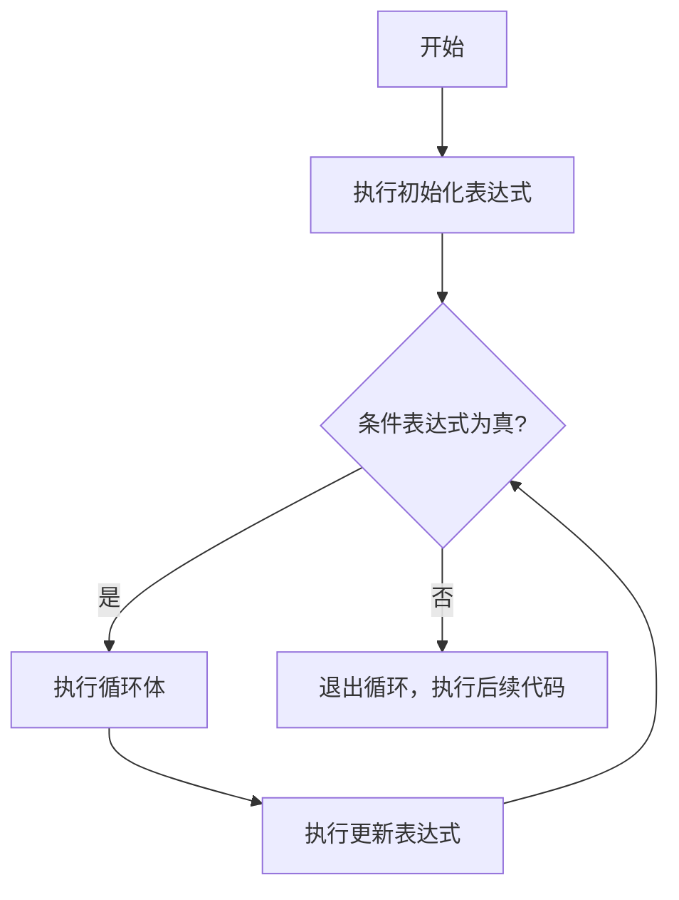
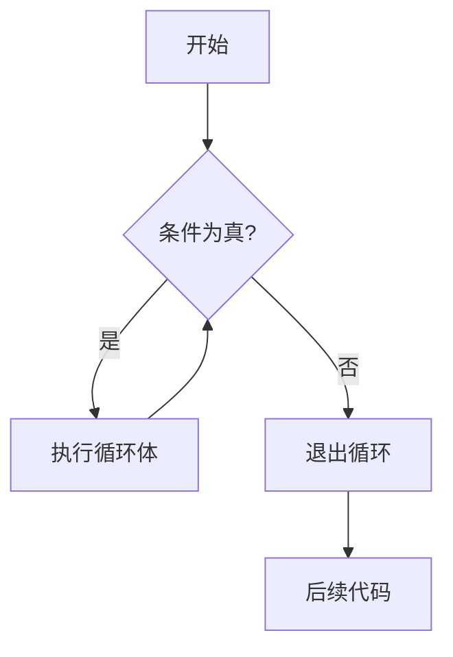
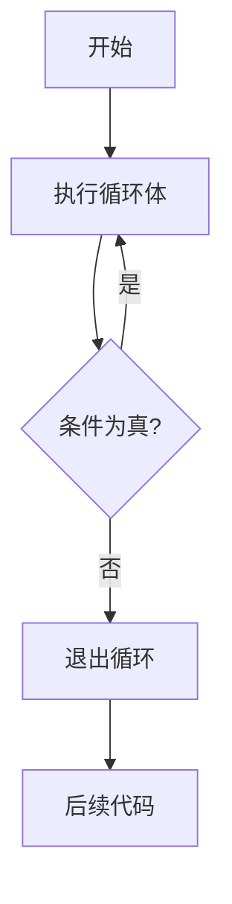
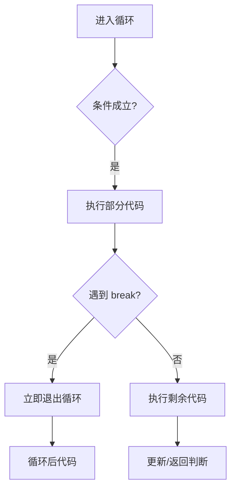
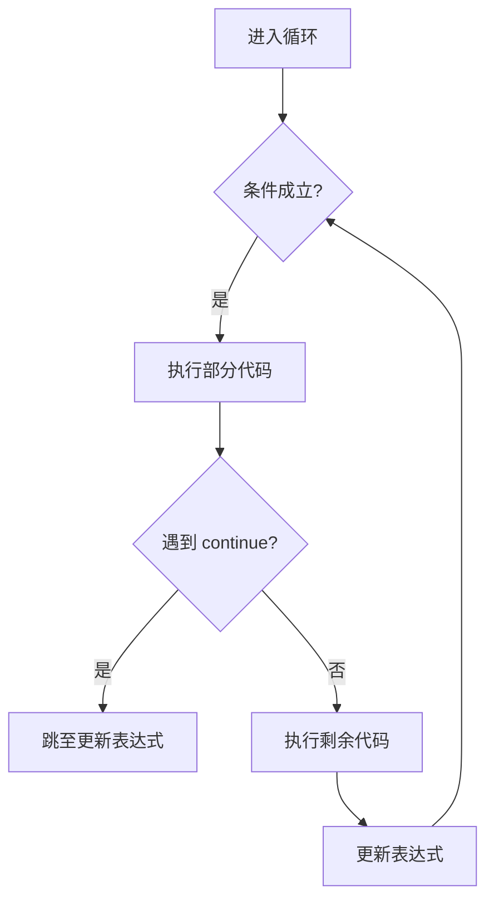
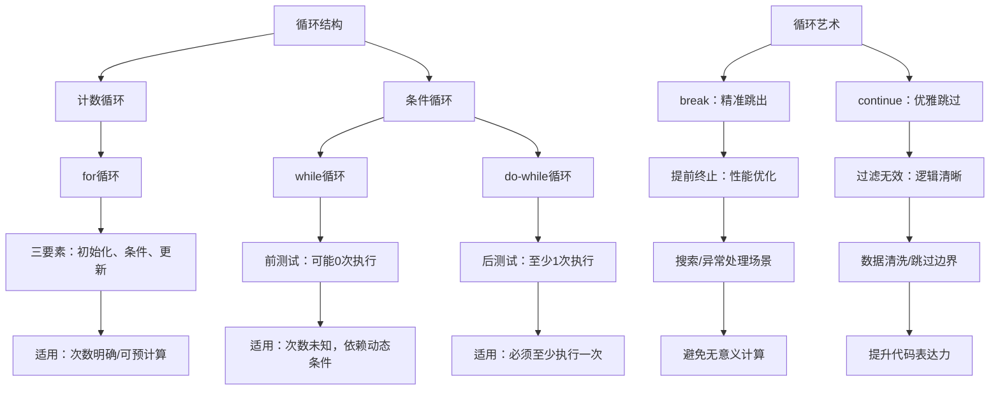

欢迎来到 C 语言学习之旅的第三天！今天，我们将深入探索编程中最具威力、最核心的结构之一 —— **循环结构**。循环允许你根据特定条件，自动、高效地重复执行某段代码，从而将枯燥、机械的重复工作交给计算机处理。掌握循环，是编写动态、高效程序的关键一步。

本章将系统讲解 C 语言中的三种循环结构：`for`、`while`、`do-while`，并传授高级控制技巧（`break`、`continue`）、常见陷阱规避方法、最佳实践原则，以及真实项目中的应用场景。学完本章，你将能自信地设计和编写任何复杂度的循环逻辑。

---

## 全景概览

在正式学习每种循环前，我们先建立一个宏观认知：

> **循环的本质**：在满足条件的前提下，重复执行一段代码块。

C 语言提供三种循环结构，它们各有侧重：

| 循环类型   | 特点                 | 最佳适用场景                  |
| ---------- | -------------------- | ----------------------------- |
| `for`      | 三要素集中，结构清晰 | 循环次数明确或可预计算        |
| `while`    | 先判断，后执行       | 循环次数不确定，可能执行 0 次 |
| `do-while` | 先执行，后判断       | 循环次数不确定，至少执行 1 次 |

> 💡 **记忆口诀**：  
> “**for 数得清，while 看条件，do-while 至少跑一圈**”

---

## `for` 循环：精确控制的迭代专家

`for` 是结构最严谨、使用最广泛的循环，特别适合**循环次数已知或可计算**的场景（如遍历数组、计数器、打印表格等）。

### 2.1 基础语法与执行机制

```c
for (初始化表达式; 条件表达式; 更新表达式) {
    // 循环体：重复执行的代码
}
```

#### 三大核心组件详解

1. **初始化表达式 (Initialization)**

   - 仅在循环**开始前执行一次**。
   - 通常用于声明并初始化循环变量，如 `int i = 0;`
   - 可声明多个变量（C99+）：`int i = 0, j = 10;`

2. **条件表达式 (Condition)**

   - 在**每次循环开始前**判断。
   - 若为真（非零），执行循环体；若为假（零），退出循环。
   - 可省略 → 默认为真 → 无限循环（慎用！）

3. **更新表达式 (Update)**
   - 在**每次循环体执行完毕后**执行。
   - 通常用于递增/递减循环变量，如 `i++`、`i += 2`。
   - 可包含多个操作，用逗号分隔：`i++, j--`

#### 执行流程图解



### 2.2 经典示例：计数器与执行追踪

```c
#include <stdio.h>

int main() {
    printf("=== 正向计数器 (0 到 4) ===\n");
    for (int i = 0; i < 5; i++) {
        printf("第 %d 次迭代 → i = %d\n", i + 1, i);
    }
    printf("循环结束！\n\n");

    printf("=== 逆向计数器 (5 到 1) ===\n");
    for (int j = 5; j >= 1; j--) {
        printf("倒数第 %d → j = %d\n", 6 - j, j);
    }
    printf("倒计时完成！\n");

    return 0;
}
```

#### 逐行执行追踪（以 `i = 0; i < 5; i++` 为例）

| 步骤 | 操作        | i 值 | 条件 `i<5` | 是否执行循环体 | 输出            |
| ---- | ----------- | ---- | ---------- | -------------- | --------------- |
| 1    | 初始化      | 0    | —          | —              | —               |
| 2    | 第 1 次判断 | 0    | true       | 是             | 第 1 次 → i = 0 |
| 3    | 更新 i++    | 1    | —          | —              | —               |
| 4    | 第 2 次判断 | 1    | true       | 是             | 第 2 次 → i = 1 |
| 5    | 更新 i++    | 2    | —          | —              | —               |
| 6    | 第 3 次判断 | 2    | true       | 是             | 第 3 次 → i = 2 |
| 7    | 更新 i++    | 3    | —          | —              | —               |
| 8    | 第 4 次判断 | 3    | true       | 是             | 第 4 次 → i = 3 |
| 9    | 更新 i++    | 4    | —          | —              | —               |
| 10   | 第 5 次判断 | 4    | true       | 是             | 第 5 次 → i = 4 |
| 11   | 更新 i++    | 5    | —          | —              | —               |
| 12   | 第 6 次判断 | 5    | false      | 否             | 退出循环        |

> **输出结果**：

```txt
=== 正向计数器 (0 到 4) ===
第 1 次迭代 → i = 0
第 2 次迭代 → i = 1
第 3 次迭代 → i = 2
第 4 次迭代 → i = 3
第 5 次迭代 → i = 4
循环结束！

=== 逆向计数器 (5 到 1) ===
倒数第 1 → j = 5
倒数第 2 → j = 4
倒数第 3 → j = 3
倒数第 4 → j = 2
倒数第 5 → j = 1
倒计时完成！
```

### 2.3 高级用法与灵活变体

#### ① 多变量控制（逗号运算符）

```c
#include <stdio.h>

int main() {
    printf("=== 双指针从两端向中间靠拢 ===\n");
    for (int left = 0, right = 9; left <= right; left++, right--) {
        printf("left = %2d, right = %2d\n", left, right);
    }
    return 0;
}
```

> **输出**：

```txt
left =  0, right =  9
left =  1, right =  8
left =  2, right =  7
left =  3, right =  6
left =  4, right =  5
```

#### ② 省略表达式（创建无限循环）

```c
// 三种写法等价，都是无限循环
for (;;) {
    printf("按 Ctrl+C 退出无限循环...\n");
    // 可配合 break 使用
}

// 等价于：
while (1) { ... }
// 或
for (;1;) { ... }
```

> ⚠️ 实际项目中应避免裸无限循环，通常配合 `break` 或外部信号退出。

#### ③ 小学生都会的

```c
#include <stdio.h>

int main() {
    printf("=== 九九乘法表 ===\n");
    for (int i = 1; i <= 9; i++) {          // 外层：控制行
        for (int j = 1; j <= i; j++) {      // 内层：控制列
            printf("%d×%d=%-2d ", j, i, i * j); // %-2d 左对齐，占2位
        }
        printf("\n"); // 每行结束换行
    }
    return 0;
}
```

> **输出片段**：

```txt
1×1=1
1×2=2  2×2=4
1×3=3  2×3=6  3×3=9
...
1×9=9  2×9=18 3×9=27 ... 9×9=81
```

---

## 条件驱动循环：`while` 与 `do-while`

当循环次数**不确定**，而是依赖于某个动态条件（如用户输入、文件读取、网络状态）时，`while` 和 `do-while` 是更自然的选择。

### 3.1 `while` 循环：先判断，后执行

**语法结构**：

```c
while (条件表达式) {
    // 循环体
}
```

**特点**：

- **前测试循环**：先判断条件，再决定是否执行循环体。
- **可能执行 0 次**：若初始条件为假，循环体一次也不执行。

#### 执行流程



#### 是活人吗

```c
#include <stdio.h>

int main() {
    int age;

    printf("请输入您的年龄（1-120）：");
    scanf("%d", &age);

    // 当输入无效时，循环提示
    while (age < 1 || age > 120) {
        printf("年龄无效！请重新输入（1-120）：");
        scanf("%d", &age); // 关键：更新条件变量！
    }

    printf("您的年龄是：%d 岁\n", age);
    return 0;
}
```

> 💡 **关键点**：  
> 循环体内**必须包含能改变条件表达式值的语句**，否则将陷入**死循环**！

#### ⚠️ 死循环示例（错误写法）

```c
int count = 0;
while (count < 5) {
    printf("Hello\n");
    // 忘记 count++ → 条件永远为真 → 死循环！
}
```

### 3.2 `do-while` 循环：先执行，后判断

**语法结构**：

```c
do {
    // 循环体
} while (条件表达式); // 注意：分号不可省略！
```

**特点**：

- **后测试循环**：先执行循环体，再判断条件。
- **至少执行 1 次**：无论条件真假，循环体至少执行一次。

#### 执行流程



#### 实战示例：交互式菜单系统

```c
#include <stdio.h>

int main() {
    int choice;

    do {
        printf("\n=== 主菜单 ===\n");
        printf("1. 查看余额\n");
        printf("2. 转账\n");
        printf("3. 退出\n");
        printf("请选择操作：");
        scanf("%d", &choice);

        switch (choice) {
            case 1:
                printf("您的当前余额：¥10,000.00\n");
                break;
            case 2:
                printf("正在处理转账请求...\n");
                break;
            case 3:
                printf("感谢使用，再见！\n");
                break;
            default:
                printf("无效选项，请重新选择！\n");
        }

    } while (choice != 3); // 用户选3才退出

    return 0;
}
```

> **优势**：菜单至少显示一次，用户体验更自然。

### 3.3 `while` vs `do-while` 对比总结

| 特性             | `while` 循环           | `do-while` 循环            |
| ---------------- | ---------------------- | -------------------------- |
| **测试时机**     | 循环体**前**测试条件   | 循环体**后**测试条件       |
| **最少执行次数** | 0 次                   | 1 次                       |
| **语法特点**     | `while (条件) { ... }` | `do { ... } while (条件);` |
| **典型场景**     | 读取文件直到 EOF       | 显示菜单、密码输入         |
| **安全提示**     | 适合不确定是否需执行   | 适合必须至少执行一次       |

> **选择原则**：
>
> - 如果“**可能不需要执行**”，选 `while`
> - 如果“**必须至少执行一次**”，选 `do-while`

---

## 循环控制艺术：`break` 与 `continue`

有时我们需要在循环中途改变流程，`break` 和 `continue` 提供了精细化的控制能力。

### 4.1 `break`：立即跳出循环

**作用**：立即终止**当前所在的最内层循环**（或 `switch`），跳转到循环后的第一条语句。

#### 执行逻辑



#### 实战示例：查找第一个素数

```c
#include <stdio.h>
#include <stdbool.h>

// 判断是否为素数
bool isPrime(int n) {
    if (n < 2) return false;
    for (int i = 2; i * i <= n; i++) {
        if (n % i == 0) return false;
    }
    return true;
}

int main() {
    int start = 10, end = 50;
    printf("在 %d 到 %d 之间查找第一个素数...\n", start, end);

    for (int num = start; num <= end; num++) {
        if (isPrime(num)) {
            printf("找到了！第一个素数是：%d\n", num);
            break; // 找到即退出，不再继续
        }
    }

    return 0;
}
// 输出：找到了！第一个素数是：11
```

### 4.2 `continue`：跳过本次迭代

**作用**：跳过当前循环体中**剩余的代码**，直接进入**下一次迭代**（执行更新表达式 → 判断条件）。

#### 执行逻辑



#### 实战示例：过滤偶数，只处理奇数

```c
#include <stdio.h>

int main() {
    printf("1 到 10 中的奇数平方：\n");
    for (int i = 1; i <= 10; i++) {
        if (i % 2 == 0) {
            continue; // 跳过偶数
        }
        printf("%d² = %d\n", i, i * i); // 只对奇数执行
    }
    return 0;
}
```

> **输出**：

```txt
1² = 1
3² = 9
5² = 25
7² = 49
9² = 81
```

#### break`vs`continue` 对比

| 语句       | 作用                   | 影响范围 | 典型场景               |
| ---------- | ---------------------- | -------- | ---------------------- |
| `break`    | 退出整个循环           | 当前循环 | 找到目标、异常中断     |
| `continue` | 跳过本次，进入下次迭代 | 当前迭代 | 过滤无效数据、跳过异常 |

---

## 常见的傻了吧唧错误

循环是初学者最容易出错的地方。掌握这些陷阱，避免变成傻了吧唧的曼波！

### 5.1 五大经典陷阱

#### ① 死循环（Infinite Loop）

**原因**：循环变量未更新，或更新方向错误。

```c
// 错误：i 永远为0
int i = 0;
while (i < 10) {
    printf("*");
    // 忘记 i++
}

// 错误：i 越更新越大
for (int i = 0; i < 10; i--) { // 应为 i++
    printf("%d ", i);
}
```

**修复**：确保循环变量向终止条件靠近。

#### ② 差一错误（Off-by-One）

**原因**：边界条件混淆（`<` vs `<=`，起始值错误）。

```c
// 少一次：打印 0~4，共5个数，但条件是 i<5 → 正确
for (int i = 0; i < 5; i++) { ... } // 正确

// 多一次：i<=5 会执行6次（0,1,2,3,4,5）
for (int i = 0; i <= 5; i++) { ... } // 可能错误

// 起始错误：从1开始，少打印0
for (int i = 1; i < 5; i++) { ... } // 少一次
```

**调试技巧**：用纸笔模拟前 2 次和最后 2 次迭代。

#### ③ 误加分号（空语句陷阱）

```c
// 灾难性错误！
for (int i = 0; i < 5; i++); { // 分号使循环体变为空语句
    printf("%d", i); // 此句在循环外执行，i=5
}
// 输出：5 （只执行一次！）

// while 同理
while (condition); { ... } // 错误！
```

**修复**：删除多余分号！

#### ④ 变量作用域错误（C89 旧标准）

```c
// C89 风格（不推荐）
int i;
for (i = 0; i < 5; i++) { ... }
// i 在循环外仍可见 → 可能被误用

// C99+ 推荐：变量作用域最小化
for (int i = 0; i < 5; i++) { ... }
// i 仅在循环内有效 → 更安全
```

#### ⑤ 浮点数比较陷阱

```c
// 危险！浮点数精度问题
for (float x = 0.0; x != 1.0; x += 0.1) {
    printf("%.1f ", x);
}
// 可能永远不等于 1.0 → 死循环！

// 正确做法：使用误差范围或整数计数
for (int i = 0; i < 10; i++) {
    float x = i * 0.1;
    printf("%.1f ", x);
}
```

---

## 一点小提高

写出正确代码只是第一步，写出**高效、可读、可维护**的循环才是专业程序员的追求。

### 6.1 选择合适的循环结构

| 场景描述          | 推荐循环             | 理由                |
| ----------------- | -------------------- | ------------------- |
| 遍历数组/固定次数 | `for`                | 结构清晰，不易出错  |
| 读取文件直到结束  | `while`              | 次数未知，可能 0 次 |
| 用户登录尝试      | `do-while`           | 至少尝试一次        |
| 游戏主循环        | `while(1)` + `break` | 灵活控制退出条件    |

### 6.2 循环变量与作用域

**最佳实践**：

- 在 `for` 初始化中声明变量（C99+）：`for (int i = 0; ...)`
- 避免在循环外声明不必要的变量。
- 使用有意义的变量名：`row`, `col`, `index` 而非 `i`, `j`, `k`（在嵌套时例外）。

### 6.3 保持循环体简洁

**原则**：循环体不宜过长。若超过 10 行，考虑封装函数。

```c
// 不推荐：循环体内逻辑复杂
for (int i = 0; i < n; i++) {
    // 20 行复杂计算...
}

// 推荐：提取为函数
void processItem(int index) {
    // 20 行复杂计算...
}

for (int i = 0; i < n; i++) {
    processItem(i);
}
```

### 6.4 性能优化技巧

#### ① 避免在条件中重复计算

```c
// 低效：每次调用 strlen()
char str[] = "Hello, World!";
for (int i = 0; i < strlen(str); i++) {
    putchar(str[i]);
}

// 高效：提前计算并缓存
int len = strlen(str);
for (int i = 0; i < len; i++) {
    putchar(str[i]);
}
```

#### ② 减少循环内函数调用

```c
// 低效
for (int i = 0; i < 1000; i++) {
    double x = sin(i * 0.01); // 重复计算
    printf("%.2f\n", x);
}

// 高效：若可预计算
double values[1000];
for (int i = 0; i < 1000; i++) {
    values[i] = sin(i * 0.01);
}
for (int i = 0; i < 1000; i++) {
    printf("%.2f\n", values[i]);
}
```

#### ③ 合理使用 `break` 和 `continue`

- `break` 可提前终止无意义的迭代。
- `continue` 可跳过异常或无效数据，避免深层嵌套。

### 6.5 代码可读性与注释

**建议**：

- 为复杂循环添加注释说明意图。
- 使用空行分隔逻辑块。
- 对嵌套循环标注层级。

```c
// 良好注释示例
// 遍历矩阵，查找最大值及其位置
int maxVal = matrix[0][0];
int maxRow = 0, maxCol = 0;

for (int row = 0; row < ROWS; row++) {     // 外层：行
    for (int col = 0; col < COLS; col++) { // 内层：列
        if (matrix[row][col] > maxVal) {
            maxVal = matrix[row][col];
            maxRow = row;
            maxCol = col;
        }
    }
}
printf("最大值 %d 位于 [%d][%d]\n", maxVal, maxRow, maxCol);
```

---

## 该实战了

整合所学知识，编写一个完整的“猜数字”小游戏：

```c
#include <stdio.h>
#include <stdlib.h>
#include <time.h>

int main() {
    int secret, guess, attempts = 0;
    const int MAX_ATTEMPTS = 7;

    // 初始化随机数种子
    srand(time(NULL));
    secret = rand() % 100 + 1; // 1~100 的随机数

    printf("欢迎来到猜数字游戏！\n");
    printf("我想了一个 1~100 的数字，你有 %d 次机会猜中它！\n", MAX_ATTEMPTS);

    // 使用 do-while 确保至少猜一次
    do {
        printf("\n第 %d 次猜测：", attempts + 1);
        scanf("%d", &guess);
        attempts++;

        if (guess == secret) {
            printf("恭喜你！%d 次就猜中了！数字是 %d\n", attempts, secret);
            break; // 胜利退出
        } else if (guess < secret) {
            printf("太小了！");
        } else {
            printf("太大了！");
        }

        // 提示剩余次数
        printf(" 还剩 %d 次机会", MAX_ATTEMPTS - attempts);

    } while (attempts < MAX_ATTEMPTS && guess != secret);

    // 游戏结束判断
    if (guess != secret) {
        printf("\n\n很遗憾，次数用完！正确答案是：%d\n", secret);
    }

    printf("感谢游玩！再见！\n");
    return 0;
}
```

> **知识点整合**：
>
> - `do-while`：保证至少猜一次
> - `break`：猜中后立即退出
> - 循环计数器：`attempts`
> - 条件判断：`guess < secret`
> - 输入验证：隐含在循环中

---

## 学习总结

### 9.1 核心知识图谱



> 💡 **图谱说明**：  
> 从基础语法出发，延伸至工程实践、性能优化、设计哲学、职业成长，构建完整的“循环能力金字塔”。循环不仅是语法，更是系统思维、工程素养、产品意识的综合体现。

---

### 9.2 必须掌握的 20 个要点

1. **for 循环三要素**：初始化、条件、更新 —— 缺一不可
2. **while 先判断原则**：条件为假时，循环体一次不执行
3. **do-while 至少一次**：无论条件真假，先跑一圈再说
4. **break 的威力**：立即跳出当前最内层循环
5. **continue 的优雅**：跳过本次剩余，直接进入下一轮
6. **死循环防范**：确保循环变量向终止条件靠近
7. **差一错误识别**：`<` 与 `<=`，起始值是否包含
8. **空语句陷阱**：`for(...);` 后面多一个分号 = 灾难
9. **变量作用域最小化**：`for(int i=0;...)` 优于外部声明
10. **浮点数循环慎用**：避免直接比较，用整数计数替代
11. **嵌套循环层级控制**：建议不超过 3 层，否则重构
12. **循环内避免昂贵操作**：如重复调用 `strlen()`、`sqrt()`
13. **提前计算缓存结果**：将不变量移出循环条件
14. **合理使用贯穿（fall-through）**：`switch` 中故意省略 `break`
15. **default 保底思维**：处理未预期输入，增强健壮性
16. **循环命名语义化**：`row/col/index/count` 优于 `i/j/k`
17. **注释说明循环意图**：尤其复杂或嵌套循环
18. **性能与可读性平衡**：不盲目优化，优先保证清晰
19. **防御式循环设计**：检查输入边界、空指针、越界
20. **调试技巧**：打印循环变量、使用断点、纸笔模拟

---

### 9.3 下一步学习建议

- **练习**：实现九九乘法表、素数筛法、数字金字塔、简易进度条动画
- **进阶**：学习数组（循环的最佳搭档）、函数（循环的封装容器）、指针（循环遍历内存）
- **深入**：研究循环展开（Loop Unrolling）、CPU 流水线与分支预测对循环性能的影响
- **项目**：开发文本菜单导航系统、学生成绩统计分析器、简易贪吃蛇游戏主循环

---

## 结语：写出有“节奏感”的代码

> “**优秀的程序员不是写循环的人，而是用循环赋予程序生命力的指挥家。**”

循环结构赋予程序重复与节奏的能力，但真正的艺术在于：

- **精准的控制力** → 像节拍器一样稳定可靠
- **优雅的终止条件** → 知道何时该停，比知道何时开始更重要
- **高效的迭代路径** → 每一次循环都物尽其用
- **清晰的层次结构** → 嵌套如诗行，缩进如乐谱

记住：**代码首先是写给人读的，其次才是给机器执行的**。让你的循环如交响乐般层次分明，让每一次迭代都铿锵有力！

> 今天，你已经谱写了第一首“重复诗”：用 `for`、`while`、`do-while` 让代码学会律动，让机器拥有节奏的灵魂。
> **编程如乐，循环如歌** —— 在重复中创造变化，在变化中保持秩序。你，就是这场数字交响乐的指挥家。
